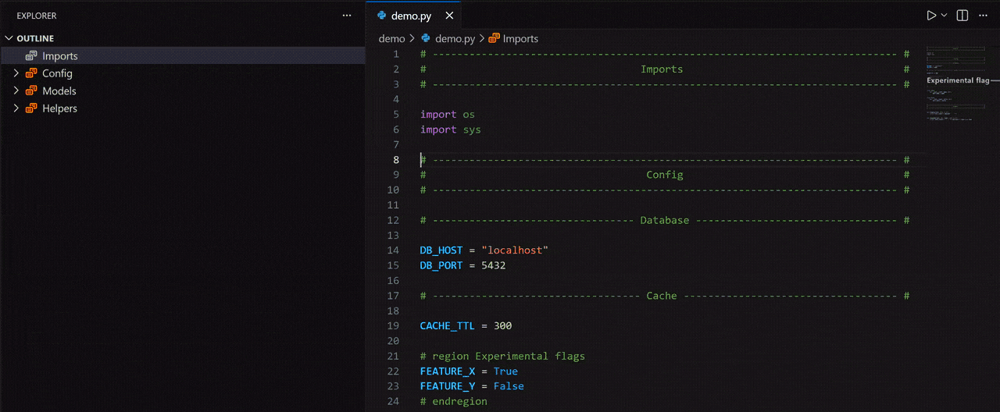

<h1 align="center"> Outline Sections</h1>

<div align="center">




[![vscode](https://img.shields.io/badge/vscode-marketplace-blue?logo=data:image/png;base64,iVBORw0KGgoAAAANSUhEUgAAADAAAAAwCAYAAABXAvmHAAAACXBIWXMAAAsTAAALEwEAmpwYAAADv0lEQVR4nO2ZvWsUQRjGZ97VJogfaSSFQbC5bWyUYGMRsbWwsBObgIWFMWBmLid4gtGZBNTOzn9ABEHZGMzsLRo/Ck935hRUSBELQQIKIrkLEjMyG8479T5mde8L7oEpd+f57b4z88wMQn311VfH5FBxDKhY2sZfPXMfFA+jXhIQMQbUXwfqayctNty5ona94suUVzyFshpQNwuoGAcqNoz5cosAKu21ATmQ11tRd0ljTMRstXGoDRC11Nzqsuutjh+4pwc67RyhbLAFE3GrlnmoA/CrecWV1NzqBNIad8j8vQFMhFfPPDQDqIBk2m8+vbgLiHjSyDzYA3xsr/nMoyGgvmpmHmwB5oq6febP+/vMHG9jHloCYAYMD0cQC/fGNj8ZHAQiVmzNQ+IA194MYq4C4EoDU+uYyWl0+7Zj86gzKUaB+F/jmIdEAfibYeDybWS+qhkgNJ0famieiuNARCmWeSJKkM6dTgwAuFr803ylyU8Ok0dqPjeZOwPE/xHvy4t36LzYb55PDoDJz/UBNksKmLxYnVcgLWjcksFE3EF0YUf5HYkBYC4vNwQolxSTD9GVwm5MxPWY5tdMFvqzXzexMaA1xkxdsoEAJktwYTFOySwjIkZqdesmPY0Cl2eByx/NIZSG7HMNNNe4ZKh/F40HO+v157ZiIQMWngSmvlv9jct5Demg1lf/bsZIs77cVq3EDiscBS6/WUFcDTVkHlUDfEAkOGTTj9vSKMHDEeDyixWEadnnGhP/PpqYH7Ttwm0pABEjkAm+RF/YEgKz8L5Z0TsO4KQXjgIR36KSyAQarryyhgAuPyCuOldCQMXJaBBWD8opA5G3hzCTACu0fxADyZ2tGw3Suc1Zx/pPRAvfXXQjbMc0qjGm/qXmi5KBeFGKAwFMLUcRvZUAmPrTVlmG+g/RlNiNubweD0KuAVOtixJA/c9NzK8DFRdRNlsJc6xAY0FsxvM7iOeTD3NA/cf1s7v/yaF+7Tg9o85YRY/f/8Y7NFtINk4jujAMRLz9O/76gdmkN3rUYeFx4DLeuOCyBKyQ3IYm0sT8oDFcLhkzLtAJyy3lTDgKXH2NW1Ju8uuAxmZzji7M70FxNVM4CFytdBjgPzX7eh8wudS7AEbT+SFgUvUugBEr7AKuniQC4LX7aLGsbH4Ac+n9L0DKK051BiCCCLZgrm79E4AXHa+f69zxevWBAZeztgCprrrgqJLJQsDkRgOAbr1iqgi4HIsOybjSDpe9dclXlsPkMeDq/fabS0977pq1r75Qd+gnbk39qO0MuGMAAAAASUVORK5CYII=)](https://marketplace.visualstudio.com/items?itemName=mantasu.outline-sections)
[](https://github.com/mantasu/outline-sections/releases/latest)
[](https://github.com/mantasu/outline-sections/actions/workflows/test.yaml)
[](https://codecov.io/github/mantasu/outline-sections)
[![License](https://img.shields.io/badge/license-MIT-red?logo=data:image/png;base64,iVBORw0KGgoAAAANSUhEUgAAADIAAAAyCAYAAAAeP4ixAAAAIGNIUk0AAHomAACAhAAA+gAAAIDoAAB1MAAA6mAAADqYAAAXcJy6UTwAAAAGYktHRAD/AP8A/6C9p5MAAAAJcEhZcwAALiMAAC4jAXilP3YAAAAHdElNRQfoAwYAMwyp1T9YAAAJQ0lEQVRo3sWaaWxU1xXHf2/zLMSAbUxsgj22QdixWRziJKjwIXVNgxwJmi8JfKkUUqlITSqqoipREqpIlRNlQ3Jpo5K0aVGU5ENSKUIswVGQJYelpNAGY1Nk18xSB483Anj2mdMPb97wGGw83uK/ZHnmzj33nd89993lvKcwO9KB5cAaoB64HygHCgFnuk4YGAF8QBfwL+AC8D8gOVMHlBnaLwd+CGwBGoD7gAU52AkQAgLAP4CjQDvQPzv9mrtqgN8B3Zi9KTP8SwCdwG+BldNxaKoRKQF+lv7zZP+4aNEiysrKqKqqoqysjOLiYtxuNyJCKBRicHAQn89HX18ffr+f69evj3eNXuAA8BdgaC6i8BhwMrs3Fy9eLFu2bJF9+/bJ6dOnJRgMSiwWk4kUi8VkYGBATp48KW+88YY0NTXJwoULx4tSO/DobAK4gN8Aw/YLLV26VHbt2iUdHR0SCoVkuhobG5P29nZ55plnpKioKBtmAPglkDdTiMXAfiBuNZ6XlydPPfWUnDlzRlKp1LQBspVIJKSjo0OeeOIJMQzDDhMF3gTypwtRAPzV3kPl5eXy3nvvSTgcnjWAbN28eVP2798vy5Yts8OkgHemA+NOG2Yae+SRR+TUqVNzBpCt9vZ2qa+vz4Z5G3DkCqEAL2FOiQJIY2OjXL58+XuDsHTx4kXZuHGjHSYG/CpXkK3ANct406ZN0tvb+71DWOrq6pKGhgY7zBCweTKIcuCcZbRq1So5f/78vEFYOn36tFRUVNhhTmKuaRMOqdetyvn5+fLJJ5/MN0NGBw8eFJfLZYfZOxHIg8BVq+Jzzz0niURivv3PKBaLyc6dO+0gPqBuvGj8wT6kenp65tv3O9TZ2Skej8cO83o2SA3gtyq89tprGeNUIiGJSEQSkYgko9FbraZSkozHJRmLSTIeF7EWx1RKktFoxiaVTGZMkrGYWR4OS2qa0X755ZftID1AhRUJ0lPa2wArVqygra2NyspKAHyHDnGxtRVSKQrXraOhpQXN6WS0s5Nzr7xCMhzGWVzMQ6++iqukhFB/P2f27CESDKK7XDS0tFCwZg2JsTHOvvAC17q6QFFYs2cPyx97jPjNm/R+8AHRkRFQVRRFAUXJ/EcxXTQWLGDljh30XL3K5qYmAoEAaZifA+/qmOeHLVZompubMxAAN71eAl98Ye61w2EkaZ6BIkND+D77jHg8zj0lJTzw0ksAJEIhvv3yS8YGBtDz8lizZw8AqWSSga++InjuHApQtX07APEbN/jmzTf5rrd3wq24AO7iYkoffZTqmho2b97M+++/bwWiGTioAtXAWgCn00lzc/PtN4+qogAqoGia7QcFVddRAVXXMz2HoqDoumljK1fS9RVrGKRSaS8FUqm7HlYy9dK2jz/+OIZhWL+sByp14CFgCUBlZSX19fXMRBlHsx1QVRyFhbgKClB0Hc1pnoA1p5PSxkYWBQImtAiStsl8TqVwFBaiLzAPnw0NDSxfvpy+vj6Ae4H1FogOsHr1aoqLi2cEYh/XiGR6VHO5+MH+/STCYRRVxV1aCoCjoICN77yTATbNbn3OlCsKWp65my8pKaGmpsYCcQANOmaiAIDa2lo0+/CZDdkikr9ixbjg6q1hkpMcDge1tbUcPXo047qV/QCgoqJidiFsSiaTnD17lpGRURRFoa6ujvLyMhCh98MPGTx7FkQobWzEs23bpO1l+VqmYx6eMAxj5sMq3cOWbAOEZDLJv7+5wJUrV1AUhaKiIhME8B8+zOWPPsrY5wKydOlSVFUlZU4ahSrpvJOu67jd7tnpfhuMfeyrqoKqqqjWemFVt81m9vK7ye12228Dp4ptksm1kbmU5Fgvy1dFxTwTk0wmiUQiU7iiOTUKINaaYF7hjjqTeHS7U5PVTysSiVjDCiCqA9eBe+LxOMPDwzlzaA4HC+67j0QohLu0NLNYKtkwuXXvlEGGhoZIJjOZ1ms6ZppymYjg8/lyvnZRfT1bjh9HUilUXce9bNktv+wVc3HMPkHkCJLla78OXMbM29Ld3Y2I5HSvaC4X+VVVd+/dOVIikeDSpUv2oksq8E/MDAWdnZ2Mjo7OuSN3sk9taA0ODtLV1ZXhAs6pmNnwawA9PT32CjPxbEqOTbX+hQsX8Hq91tch4GsVuAhcArhx4wbHjx8f1zjXafGus5ZM3mIu98ixY8cIh8PW107gsgqMAl9YpYcOHSIYDN7yS9PQDANN08w90ST3gKIoaC4XusOB5nbftvXXdR3DMDAMA1VVM+WqYaCpKpqqmlv/u8jv93PkyBF70XFgzPLqIcyHLUWapnHgwAF27twJwJjfz2hXF4jgKCxkyYMP3n4uyVIyGmX4/HmSkQiKplGwejWOggJEhKtXrxKJRFEUKCoqIj/fzICOdnYyZp74uMfjYfH990/YfmtrK7t377Yi9y3w43RUADCAj9PxlocfflgGBgbmO9dwh/x+v6xdu9Z+5vozcEevNmEujqIoirS0tMy333foxRdftEMMAxvHi5oB/M2qWFpaKh0dHfPte0ZtbW3Zz0/+OF40LK0FrliVN23aJH6/f74ZpLe3Nzv/+x9gFZNoF2bWWwDZvn27jIyMzBtEMBiUbdu22SHCwE8ngwDzfPInm6E8/fTT8wITDAZlx44d2UmVfenbICfdCxyxN/Dkk0+K1+v93iB6enpk69at2RCfYr6EMCVVASfsDW3YsEFOnDgxpwCpVEo+//xzWb9+fTbEUWz5henA3BaZ4uJi2bt3rwQCgVmH8Hq98vzzz0thYWE2xN+BsulCWCoB3sU2AQCybt06aW1tFZ/PN2OAvr4+eeutt6Suri4bIAL8HiiaKYQlF/ALzGcSmQspiiLV1dWye/duOXbsmPT390s8Hp/U8VgsJoFAQA4fPizPPvusrFy5crxM6X8x37DI6Rn7VE9BDwC/Bn5C1sszTqcTj8dDbW0t1dXVeDwelixZgsvlAiAUCjE0NITX66W7u5vu7m58Ph/RaDT7Gtcxb+q3se2h5kIOzOz9p5g75wnzz5qmiWEYYhiGqKo62Ys1w5j7vSamML1ONyLZQOsxnwL/CHOlXTiFNgX4DnOVbgMOYb7DFZuOM7N1wF4CrAM2YJ7/VwGlmG8qWAeMBOaw+Tbt/NfAKcyXz3JP30yg/wOnLmUjzQSuRAAAACV0RVh0ZGF0ZTpjcmVhdGUAMjAyNC0wMy0wNlQwMDo1MTowNyswMDowMPvI400AAAAldEVYdGRhdGU6bW9kaWZ5ADIwMjQtMDMtMDZUMDA6NTE6MDcrMDA6MDCKlVvxAAAAKHRFWHRkYXRlOnRpbWVzdGFtcAAyMDI0LTAzLTA2VDAwOjUxOjEyKzAwOjAwQxJVFwAAABl0RVh0U29mdHdhcmUAd3d3Lmlua3NjYXBlLm9yZ5vuPBoAAAAASUVORK5CYII=)](https://opensource.org/licenses/MIT)


</div>

## About

Organize your code with comment-based sections in the [VS Code](https://code.visualstudio.com/) **Outline** view. In addition to built-in tree-view elements (``class``, ``method``, etc.), this extension adds support for comment _banners_ and _[region blocks](https://code.visualstudio.com/docs/editing/codebasics#_folding)_ (`#region` / `#endregion`) that also appear as navigable and collapsible sections in the built-in **Outline**.

> [!TIP]
> This extension is compatible with [Comment Divider](https://marketplace.visualstudio.com/items?itemName=stackbreak.comment-divider) (strongly recommended)


## Preview

| Example | Original | With Sections  |
| ------- | -------- | -------------- |
|  |  |  |

## Supported Languages

<div align="center">

| Supported Languages   | Supported Analyser  | Region Comment Style |
| -------------------: | :----------------- | :-------------------: |
| [](https://developer.mozilla.org/en-US/docs/Web/JavaScript) [](https://www.typescriptlang.org/) | [typescript-language-features](https://github.com/microsoft/vscode/tree/main/extensions/typescript-language-features) (built-in) | `// #region Name` \| `// #endregion` |
| [](https://www.python.org/) | [vscode-pylance](https://marketplace.visualstudio.com/items?itemName=ms-python.vscode-pylance)  | `# region Name` \| `# endregion` |
| [](https://en.wikipedia.org/wiki/C_(programming_language)) [](https://en.wikipedia.org/wiki/C%2B%2B) | [cpptools](https://marketplace.visualstudio.com/items?itemName=ms-vscode.cpptools) | `// #region Name` / `// #endregion` |
| [](https://www.rust-lang.org/) | [rust-analyzer](https://marketplace.visualstudio.com/items?itemName=rust-lang.rust-analyzer) | `// #region Name` / `// #endregion` |

</div>

## Development Notes

Install the latest version of [Node.js LTS](https://nodejs.org) and the dependent packages (note all packages install locally into `node_modules/` so no virtual environment is needed):
```bash
make setup
```

> **Windows:** install Node.js LTS from [nodejs.org](https://nodejs.org) manually, then use `make install` (requires [Git Bash](https://gitforwindows.org) or [WSL](https://learn.microsoft.com/en-us/windows/wsl/install)).


```bash
npm run test                          # run tests + generate coverage report
npm run package                       # compile → out/ and build .vsix (what gets published)
npx semantic-release --dry-run        # preview next release version and notes
```

> [!TIP]
> You can run `make clean` to clean up compiled/generated files.

Press **F5** in VS Code to launch an Extension Development Host with the extension loaded.

<details>
<summary>How it works?</summary>

The extension uses [VS Code API](https://code.visualstudio.com/api) to parse the document and create section markers as [document symbols](https://microsoft.github.io/language-server-protocol/specifications/lsp/3.18/specification/#textDocument_documentSymbol) based on comments. It then "injects" those symbols into the [LSP](https://microsoft.github.io/language-server-protocol/) communicator's parse commands provided by the analyser extension (which depends on language). It's a bit of a simplification but that's the rough idea.

</details>